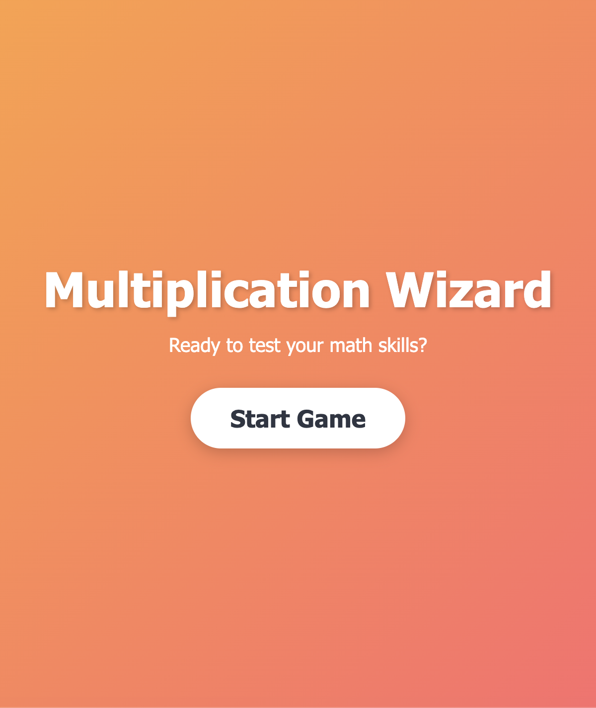
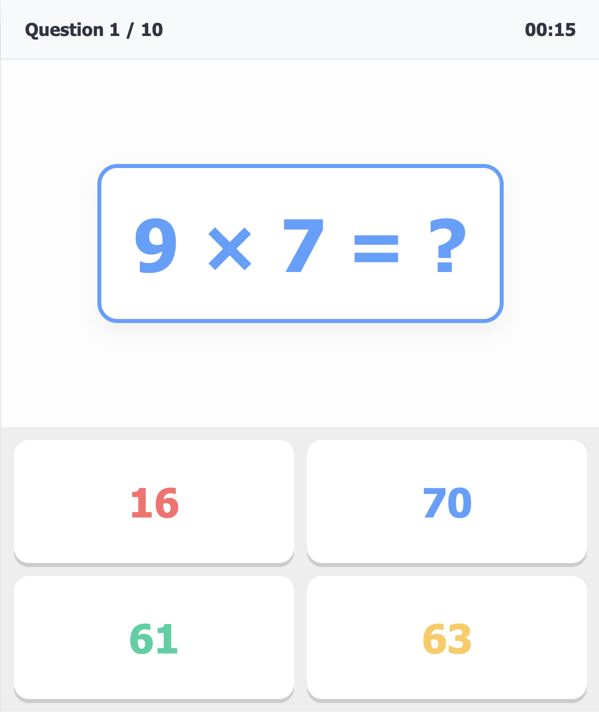
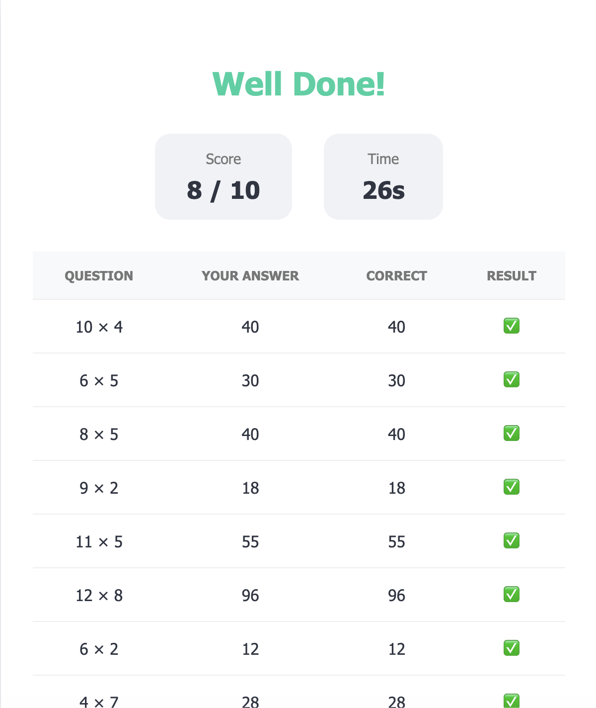

# Multiplication Wizard 🧙‍♂️✨

Multiplication Wizard is a fun, interactive web application designed to help primary school children master their multiplication tables. It turns learning into an engaging game, providing immediate feedback and a sense of accomplishment.

## 📸 Screenshots

### Start Screen

### Gameplay

### Results Summary

## 🌟 Features

-   **Randomized Challenges:** Generates 10 unique multiplication questions per session, ranging from 2×1 up to 12×12.
-   **Smart Distractors:** Multiple-choice options are intelligently generated to include common pitfalls and near-misses, encouraging careful calculation.
-   **Interactive Feedback:**
    -   **Visuals:** Animations for correct and incorrect answers.
    -   **Auditory:** Encouraging voice feedback using speech synthesis (e.g., "Good Job!", "Good Try!").
-   **Performance Tracking:**
    -   **Live Timer:** Keeps track of how long the session takes.
    -   **Results Summary:** Shows the final score and time taken.
    -   **Detailed Review:** A table showing every question, the child's answer, and the correct answer for easy review and learning.
-   **Kid-Friendly Design:** Colorful, responsive interface that works great on both tablets and computers.

## 🚀 How to Use

1.  Open `index.html` in any modern web browser.
2.  Click **"Start Game"** to begin the session.
3.  Choose the correct answer from the four options provided.
4.  After 10 questions, review the results and try to beat your previous score or time!

## 🛠️ Technology Stack

-   **HTML5:** Structure and content.
-   **Vanilla CSS:** Modern, responsive styling with CSS variables and animations.
-   **Vanilla JavaScript:** Game logic, state management, and Web Speech API integration.

## 👨‍👩‍👧‍👦 Why I Built This

I created Multiplication Wizard as a tool for my primary school children. I wanted to provide them with a way to practice their math skills that felt more like a game than a chore. By adding elements like a timer, colorful feedback, and speech synthesis, it makes the repetitive task of learning multiplication tables much more enjoyable and effective.
